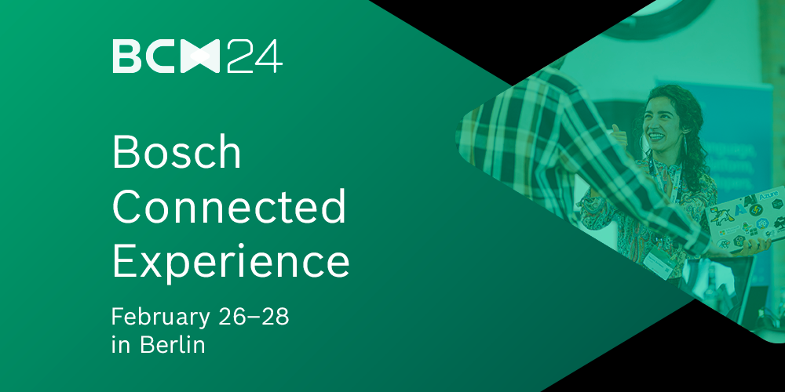
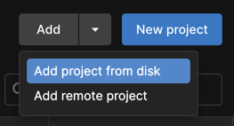
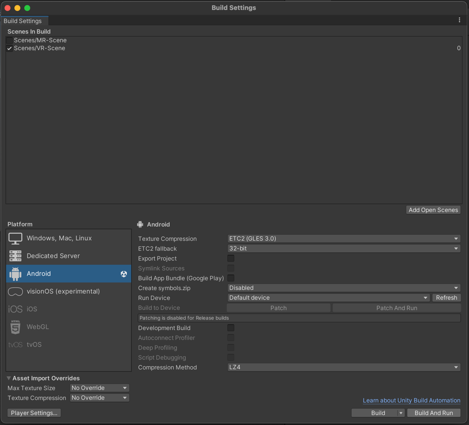

# BCX XR-Template

This repository includes a complete, buildable Unity project template to kickstart your development environment for virtual and mixed reality.
## Requirements
- Unity [2022.3.15f1](https://unity.com/releases/editor/whats-new/2022.3.15) or newer
- Windows or Mac
- Meta Quest 3, Quest 2 or Quest Pro

## Getting Started

1. Clone the repository to your local machine.

```bash
git clone https://github.com/Bosch-ConnectedExperience-2024/BD-BCX-Unity-XR-Template.git
```

2. Add the project to Unity Hub:



3. Edit the target scene:

- Virtual Reality: Assets/Scenes/VR-Scene.unity
- Mixed Reality: Assets/Scenes/MR-Scene.unity 

4. Open Build Settings and select "Android" as the platform.
5. Click on "Switch Platform" and wait for the process to complete.
6. Connect your Quest headset to your computer and make sure it is in developer mode.
7. Side load the app to your Quest headset by selecting the target scene and click on "Build and Run".


